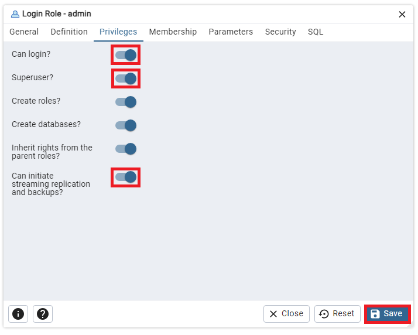

# راهنمایی برای اجرای برنامه

## نصب و راه‌اندازی دیتابیس

1. نصب PostgreSQL:

قبل از شروع به هر کاری، باید PostgreSQL را بر روی سیستم خود نصب کنید. می‌توانید PostgreSQL را از [اینجا](https://www.postgresql.org/download/) دانلود و نصب کنید.

2. ایجاد superuser:

پس از نصب، باید یک superuser با دسترسی ورود به نام admin و رمز عبور 123 ایجاد کنید. این کار می‌تواند از طریق رابط کاربری PostgreSQL یا از طریق دستورات SQL انجام شود.

مراحل:

3. ایجاد دیتابیس:

سپس به کمک superuser admin وارد PostgreSQL شوید و یک دیتابیس به نام exin ایجاد کنید. این دیتابیس باید با superuser admin به عنوان owner ایجاد شود.

